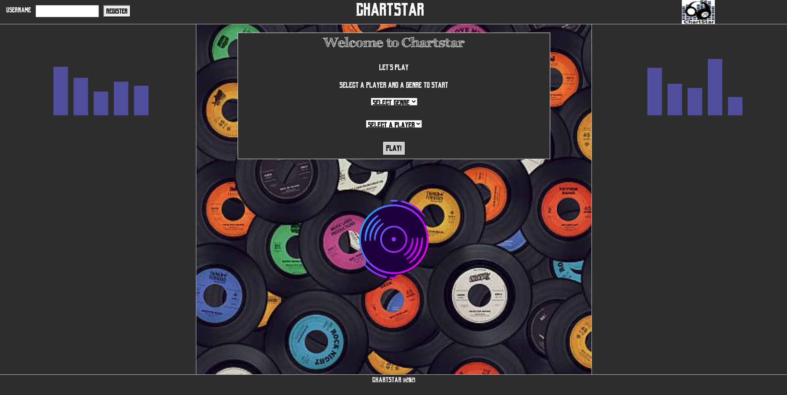

# CHARTSTAR MUSIC QUIZ

This is a group project completed by:

* Pooja Maheshwari
* Martin Sutherland
* Ahmet Giritli

The team opted to push the boundaries of the given briefs and consolidated the following two briefs to come up with the project. 

## The Brief(s)

1. Browser Game

Create a browser game based on an existing card or dice game. Model and test the game logic and then display it in the browser for a user to interact with.

Write your own MVP with some specific goals to be achieved based on the game you choose to model.

You might use persistence to keep track of the state of the game or track scores/wins. Other extended features will depend on the game you choose.

2. Educational App

The BBC are looking to improve their online offering of educational content by developing some interactive browser applications that display information in a fun and interesting way. Your task is to make an a Minimum Viable Product or prototype to put forward to them - this may only be for a small set of information, and may only showcase some of the features to be included in the final app.

MVP
A user should be able to:

view some educational content on a particular topic
be able to interact with the page to move through different sections of content
Example Extensions
Use an API to bring in content or a database to store information.
Use charts or maps to display your information to the page.

### Project Summary

ChartStar is a web based music quiz which utilises the weekly iTunes charts api to provide a music quiz relevant to music trends. The app provides "bite-size" general knowledge per selected genre. The general knowledge provided can be about instruments, artists, biographical/discographical and just plain weird facts!!!

This app was created with the mindset of being able to generate traffic through a very simple, intuitive and yet addictive concept. We have also created a persistent db to store and track user information. Our aim is to make the app scalable, so it can apply to different categories and formats and ultimately, the end goal is to be able to utilise live multiplayer sessions. 

### Setup

#### Server Setup 

1. After pulling repo, navigate to group_education_app_project/server
2. Run following command to install relevant modules:
* npm install
3. Now seed the db via:
* npm run seeds
4. Finally run db:
* npm run server:dev

#### Run App
1. Navigate to group_education_app_project/client
2. Run following command to install relevant modules:
* npm install
3. Now run app:
* npm start

After these steps if the browser does not automatically launch with the app, open browser(preferably chrome) and navigate to:
* http://localhost:5000

You should see the following: (p.s. If you want a challenge, try jazz!!!)

